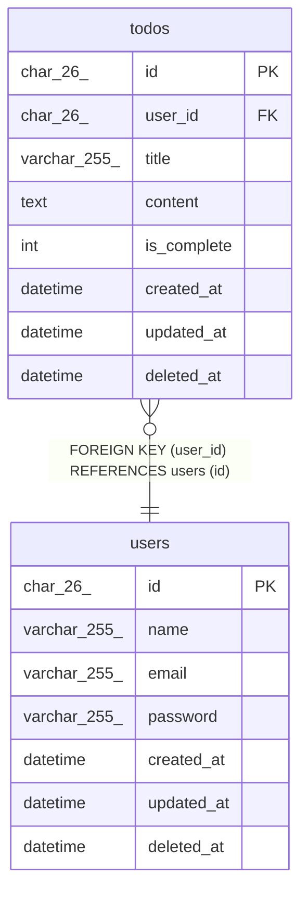

# todo_db

## Tables

| Name | Columns | Comment | Type |
| ---- | ------- | ------- | ---- |
| [todos](todos.md) | 8 | Todo | BASE TABLE |
| [users](users.md) | 7 | ユーザー | BASE TABLE |

## Relations

---

> Generated by [tbls](https://github.com/k1LoW/tbls)
