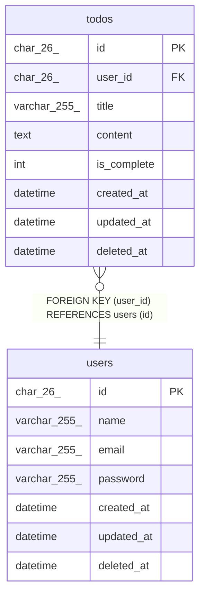

# todos

## Description

Todo

<details>
<summary><strong>Table Definition</strong></summary>

```sql
CREATE TABLE `todos` (
  `id` char(26) NOT NULL COMMENT 'Todo識別子',
  `user_id` char(26) NOT NULL COMMENT 'Todoを作成したユーザーの識別子',
  `title` varchar(255) NOT NULL COMMENT 'Todoのタイトル',
  `content` text COMMENT 'Todoの内容',
  `is_complete` int NOT NULL COMMENT 'Todoの状態',
  `created_at` datetime NOT NULL COMMENT '作成日時',
  `updated_at` datetime NOT NULL COMMENT '更新日時',
  `deleted_at` datetime DEFAULT NULL COMMENT '削除日時',
  PRIMARY KEY (`id`),
  KEY `fk_user_id` (`user_id`),
  CONSTRAINT `fk_user_id` FOREIGN KEY (`user_id`) REFERENCES `users` (`id`) ON DELETE RESTRICT ON UPDATE RESTRICT
) ENGINE=InnoDB DEFAULT CHARSET=utf8mb4 COLLATE=utf8mb4_0900_ai_ci COMMENT='Todo'
```

</details>

## Columns

| Name | Type | Default | Nullable | Children | Parents | Comment |
| ---- | ---- | ------- | -------- | -------- | ------- | ------- |
| id | char(26) |  | false |  |  | Todo識別子 |
| user_id | char(26) |  | false |  | [users](users.md) | Todoを作成したユーザーの識別子 |
| title | varchar(255) |  | false |  |  | Todoのタイトル |
| content | text |  | true |  |  | Todoの内容 |
| is_complete | int |  | false |  |  | Todoの状態 |
| created_at | datetime |  | false |  |  | 作成日時 |
| updated_at | datetime |  | false |  |  | 更新日時 |
| deleted_at | datetime |  | true |  |  | 削除日時 |

## Constraints

| Name | Type | Definition |
| ---- | ---- | ---------- |
| fk_user_id | FOREIGN KEY | FOREIGN KEY (user_id) REFERENCES users (id) |
| PRIMARY | PRIMARY KEY | PRIMARY KEY (id) |

## Indexes

| Name | Definition |
| ---- | ---------- |
| fk_user_id | KEY fk_user_id (user_id) USING BTREE |
| PRIMARY | PRIMARY KEY (id) USING BTREE |

## Relations



---

> Generated by [tbls](https://github.com/k1LoW/tbls)
