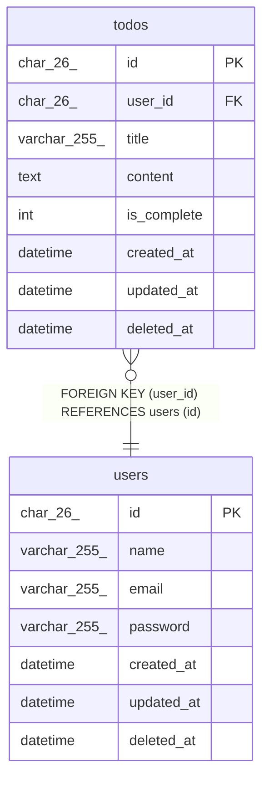

# users

## Description

ユーザー

<details>
<summary><strong>Table Definition</strong></summary>

```sql
CREATE TABLE `users` (
  `id` char(26) NOT NULL COMMENT 'ユーザー識別子',
  `name` varchar(255) NOT NULL COMMENT 'ユーザー名',
  `email` varchar(255) NOT NULL COMMENT 'メールアドレス',
  `password` varchar(255) NOT NULL COMMENT 'パスワードハッシュ',
  `created_at` datetime NOT NULL COMMENT '作成日時',
  `updated_at` datetime NOT NULL COMMENT '更新日時',
  `deleted_at` datetime DEFAULT NULL COMMENT '削除日時',
  PRIMARY KEY (`id`),
  UNIQUE KEY `uix_email_01` (`email`)
) ENGINE=InnoDB DEFAULT CHARSET=utf8mb4 COLLATE=utf8mb4_0900_ai_ci COMMENT='ユーザー'
```

</details>

## Columns

| Name | Type | Default | Nullable | Children | Parents | Comment |
| ---- | ---- | ------- | -------- | -------- | ------- | ------- |
| id | char(26) |  | false | [todos](todos.md) |  | ユーザー識別子 |
| name | varchar(255) |  | false |  |  | ユーザー名 |
| email | varchar(255) |  | false |  |  | メールアドレス |
| password | varchar(255) |  | false |  |  | パスワードハッシュ |
| created_at | datetime |  | false |  |  | 作成日時 |
| updated_at | datetime |  | false |  |  | 更新日時 |
| deleted_at | datetime |  | true |  |  | 削除日時 |

## Constraints

| Name | Type | Definition |
| ---- | ---- | ---------- |
| PRIMARY | PRIMARY KEY | PRIMARY KEY (id) |
| uix_email_01 | UNIQUE | UNIQUE KEY uix_email_01 (email) |

## Indexes

| Name | Definition |
| ---- | ---------- |
| PRIMARY | PRIMARY KEY (id) USING BTREE |
| uix_email_01 | UNIQUE KEY uix_email_01 (email) USING BTREE |

## Relations



---

> Generated by [tbls](https://github.com/k1LoW/tbls)
